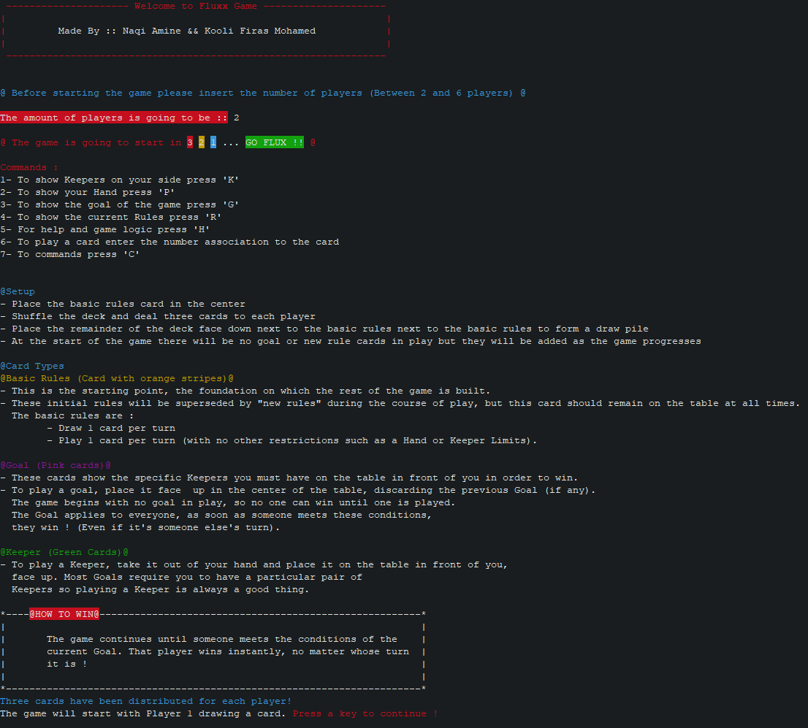

# Fluxx Game Project
<br>

<p align="center">
    <kbd>
        
    </kbd>
</p>

<br>

## Project Made By :

| Names                | StudentID  |
|        :---:         |    :---:   |
| Kooli Firas Mohamed  |  0595437   |
| Naqi Amine           |  0562497   |


#### You can run the game with this command :

```
java -jar Fluxx.jar
```
#### Or double click the Fluxx.bat file if you use windows.

#### For linux/mac users you can use the shell file.
```
sudo chmod +x run.sh
./run.sh
```

# How To Play Our Implementation:  
```
One of the main axes of our implementation of Fluxx was providing a great UX. 
Thus, we tried to make it as simple and user-friendly as possible. 

Here is a small guide on how to enjoy it: 
    - Start by going to the "Fluxx.jar" file location.
    - Open the CMD from there.
    - Run the command mentioned above "java -jar Fluxx.jar"
    - The game will launch next.
    - You should be prompted to provide the number of players, which should be at least 2 and at most 6. 
    - Once done, wait for a few seconds for the cards troll to wake up and shuffle the deck.
    - The first player will automatically start and will a receive a new drawn card.
    - Press any key number to continue. 
    - First player now will have to choose a card to play by typing its corresponding number. 
    - Once done, their turn ends and they have to press a key number to confirm. 
    - The next player takes over now and has to go through the same steps. 
    - Once a player matches the current goal, they win! :)

Things that you need to be aware of regarding this implementation:
    - At any given time, you can always press "C" to get the commands list. 
    - Always press a key number to confirm so the game moves on. 
    - In case the hand-limit was lowered during another player's turn to a value that is 
    less than your cards in hand, you will be asked to 
        discard the extra ones at the start of your turn to match the new hand-limit. 
    - Same logic applies for keeper cards.
    - In case you set a new play limit that is lower than the current one and you have 
    passed the new number of plays, your turn will end immedialty.

Finally, have fun and send us your feedback! :)
```
